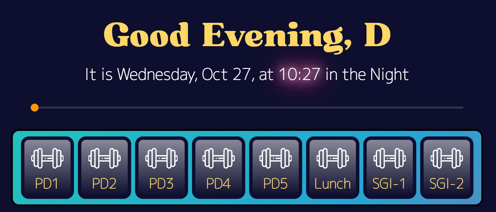

<p align="center">
  <a href="" rel="noopener">
 </a>
</p>

<h1 align="center">Eleanor Roosevelt High School Calender</h1>

<div align="center">

[]()
[](/LICENSE)

</div>

---

<p align="center"> 
    <br> 
</p>

## 📝 Table of Contents

- [About](#about)
- [Getting Started](#getting_started)
- [Deployment](#deployment)
- [Usage](#usage)
- [Built Using](#built_using)
- [TODO](../TODO.md)
- [Contributing](../CONTRIBUTING.md)
- [Authors](#authors)
- [Acknowledgments](#acknowledgement)

## 🧐 About <a name = "about"></a>

During the COVID-19 quarantine, Eleanor Roosevelt High School adopted "blended learning", which gave students the choice to attend school on Zoom or in person in one of three different cohorts. As a result, remote school days were very complicated: schedules alternated betwen <i>Day 1's</i>, where you had periods 1-5 and, <i>Day 2's</i>, where you had periods 6-9. At the end of each day, you also had two periods of <i>SGI</i>, which were classes that changed every week according to the principal's email. Students went to the wrong zoom class all the time, and many students constantly missed zoom classes.

The Eleanor Roosevelt High School Calender is a tool I made during blended learning to help myself and classmates keep track of the current class based on the principal's emailed schedule. It uses a JSON file converted from the calender's HTML table, and a txt file with the student's periods 1-9 zoom links.

## 🏁 Getting Started <a name = "getting_started"></a>

A live demo of the website is available on

### Prerequisites

What things you need to install the software and how to install them.

```
Give examples
```

### Installing

A step by step series of examples that tell you how to get a development env running.

Say what the step will be

```
Give the example
```

And repeat

```
until finished
```

End with an example of getting some data out of the system or using it for a little demo.

## ⛏️ Built Using <a name = "built_using"></a>

- [MongoDB](https://www.mongodb.com/) - Database
- [Express](https://expressjs.com/) - Server Framework
- [VueJs](https://vuejs.org/) - Web Framework
- [NodeJs](https://nodejs.org/en/) - Server Environment
